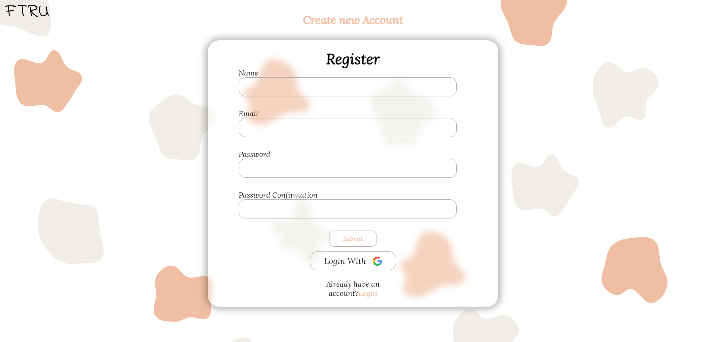
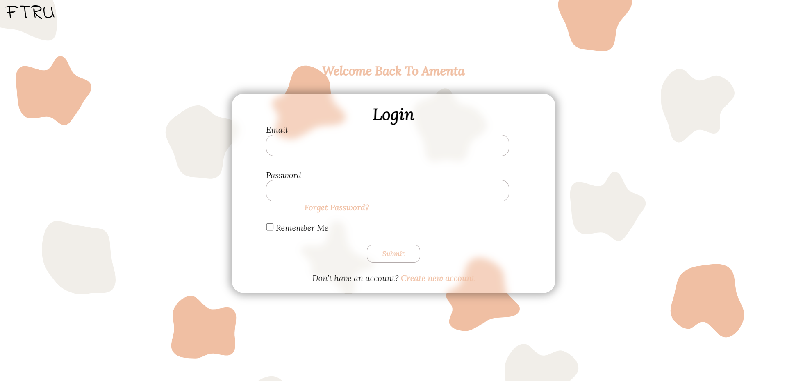
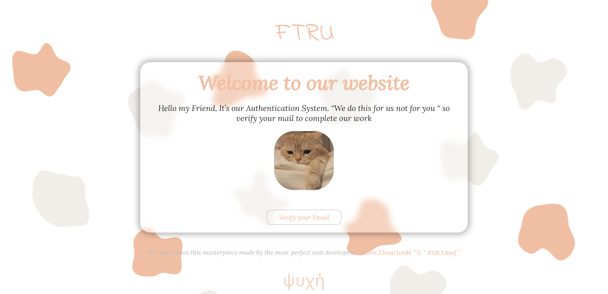

# FTRU AMENTA AUTH

## Description 
Ftru Amenta Auth is a frontend authentication project designed to provide a secure and seamless sign-in experience for users. The project focuses on implementing a robust authentication system that enables users to sign in or log in securely to access the main index page.
## Table of Contents
* Installation
* Usage
* Features
* Technologies Used
* Contributing

## Installation
### 1. Clone the Repository
```bash
git clone https://github.com/RizkUssef/User_Auth_System.git
```
### 2. Navigate to the Project Directory
```bash
cd User_Auth_System
```

## Usage
### To Start the Project
```
open the index.html file
```
Upon opening the index file, users gain access to a navigational hub, enabling seamless exploration across various pages within the application. This central entry point allows for effortless traversal, granting users the ability to seamlessly navigate through the entirety of the application's interface.

## Features
### 1. User Sign-up
Users can register using their email or a quick sign-up via Google authentication.



### 2. Login System
A secure login process allows users to access their accounts effortlessly.



### 3. Email Verification
Upon signup, an Email with button is dispatched to the user's email for verification, Once the user clicks on this button, their email will be verified.



### 4. Forgot Password
In the event of a forgotten password, Users can enter their email address to receive a mail that will allow them to change their password.


### 5. Reset Password
Securely reset passwords by following the password reset procedure


## Technologies Used
* HTML
* CSS
* SCSS
* JavaScript


